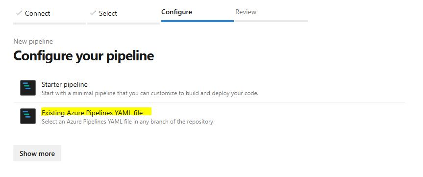

# FinOps - Downgrade e Upgrade Automatizado com Ansible e Azure DevOps

# Introdução

Esse projeto é uma prova de conceito para demonstrar como reduzir custos de recursos da nuvem Azure, utilizando ferramentas de automação Ansible e Azure DevOps.

Vou demonstrar na prática como fazer _downgrade_ e _upgrade_ da camada de preço do **Azure Service Plan** em horários estratégicos, de uma forma simples e com pouco código.

Para você reproduzir essa prova de conceito, serão necessários alguns requisitos descritos abaixo:

# Requisitos

- [Git](https://git-scm.com/downloads)
- [Visual Code](https://code.visualstudio.com/) ou qualquer editor de código
- [Azure DevOps](https://azure.microsoft.com/pt-br/products/devops)
- [Azure](https://azure.microsoft.com/en-us/pricing/purchase-options/azure-account)
- [Ansible](https://docs.ansible.com/ansible/latest/index.html)
- [azure.azcollection](https://docs.ansible.com/ansible/latest/collections/azure/azcollection/index.html)
- [Criar Azure Resource Group](https://learn.microsoft.com/pt-br/azure/azure-resource-manager/management/manage-resource-groups-portal)
- [Criar App Service Plan no Resource Group](https://learn.microsoft.com/pt-br/azure/app-service/app-service-plan-manage)
- [Criar Azure Service Principal](https://learn.microsoft.com/pt-br/azure/devops/pipelines/library/connect-to-azure?view=azure-devops)
- [Autorizar Service Principal no Resource Group como Contributor](https://learn.microsoft.com/pt-br/azure/role-based-access-control/role-assignments-portal)


# Prova de Conceito

Nessa POC será demonstrado como fazer o downgrade e upgrade do **SKU** (Camada de preço) do recurso _Azure App Service Plan_ através da automação no Azure DevOps Pipelines utilizando [Ansible](https://docs.ansible.com/) e a coleção [azure.azcollection](https://galaxy.ansible.com/ui/repo/published/azure/azcollection/).


## 1 - Criando tarefas Ansible

Crie a pasta inicial da solução:

```
mkdir finopsxday-poc && cd finopsxday-poc
```

Inicie o git no repositório:

```
git init
```

Abra a pasta no Visual Code:

Crie a estrutura de pastas manualmente:

ansible > roles > app-service-plan > tasks

Ou pelo terminal:

```
mkdir ansible && cd ansible && mkdir roles && cd roles && mkdir app-service-plan && cd app-service-plan && mkdir tasks
```

Sua estrutura de pastas ficará dessa forma:


Na pasta **tasks** adicione um novo arquivo com o nome **main.yml** com o seguinte conteúdo:

```yaml
# Downgrade Tasks

- name: '[Downgrade] Execute App Service Plan'

  azure_rm_appserviceplan:

    resource_group: "{{ resource_group }}"

    name: "{{ plan_name }}"

    sku: "{{ sku_downgrade }}"

    location: "{{ location }}"

  when: downgrade | bool

  

- name: '[Downgrade] Get status after update'

  azure_rm_appserviceplan_info:

    resource_group: "{{ resource_group }}"

    name: "{{ plan_name }}"

  register: facts

  when: downgrade | bool

  

- debug:

    var: facts.appserviceplans[0].sku

  when: downgrade | bool

  

# Upgrade Tasks

- name: '[Upgrade] Execute App Service Plan'

  azure_rm_appserviceplan:

    resource_group: "{{ resource_group }}"

    name: "{{ plan_name }}"

    sku: "{{ sku_upgrade }}"

    location: "{{ location }}"

  when: not downgrade | bool

  

- name: '[Upgrade] Get status after update'

  azure_rm_appserviceplan_info:

    resource_group: "{{ resource_group }}"

    name: "{{ plan_name }}"

  register: facts

  when: not downgrade | bool

  

- debug:

    var: facts.appserviceplans[0].sku

  when: not downgrade | bool
```

### Explicando o código

Podemos ver no código o uso dos módulos **azure_rm_appserviceplan** e o **azure_rm_appserviceplan_info** que são utilizados para manipular e obter informações do recurso do tipo App Service Plan da Azure.

Para cada ação de **downgrade** e **upgrade** são executadas três tarefas:

1. _Execute App Service Plan_: Irá modificar o sku do recurso na Azure.
2. _Get status after update_: Obtém o estado atual do recurso na Azure.
3. _debug_: Loga no console a propriedade sku do recurso.

As tarefas são executadas na sequência que estão codificadas no arquivo **main.yml** e parametrizam por meio de variáveis somente as propriedades necessárias para o azcollection alterar o recurso.

Em resumo, o objetivo desse arquivo é ser reutilizável e implementar somente os parametros necessários para alterar a camada de preço do App Service Plan.

## 2 - Criando o Ansible Playbook

Agora crie o arquivo na raiz da pasta **ansible** com nome **playbook_dev.yml** e adicione o seguinte código:

```yaml
- hosts: localhost

  name: Run Downgrade and Upgrade Infra

  connection: local

  collections:

    - azure.azcollection

  tasks:

    - name: App Service Plan - app-finopsx-lab

      include_role:

        name: app-service-plan

      vars:

        plan_name: app-finopsx-lab

        sku_upgrade: B2

        sku_downgrade: B1

        location: eastus2
```

 

❗ Altere as variáveis de acordo com o nome e região do recurso que você criou na Azure.

### Explicando o código

O Playbook do Ansible é um roteiro de execuções, no exemplo acima, basicamente ele está utilizando as regras que criamos na **Etapa 1** passando as informações do recurso para a regra implementada lá no arquivo **main.yml**.

- hosts: Utilizamos **localhost** porque vamos rodar esse código na pipeline, mas poderia ser algum host configurado no Ansible.
- name: É o nome da Tarefa que o playbook irá executar.
- connection: É o tipo de conexão, no nosso caso, rodando na pipeline é **local**.
- collections: São as coleções que desejamos utilizar do Ansible nessa poc utilizamos somente o **azure.azcollection**.
- tasks > name: É o nome da tarefa.
- tasks > include_role > name: É o nome da pasta que criamos dentro do .ansible > roles, ou seja **app-service-plan**.
- task > vars: São as propriedades do recurso da Azure que vamos passar para o Ansible.

**Variavéis**

- **plan_name**: Nome do recurso.
- **sku_downgrade**: O código do SKU quando for executado a tarefa de _Downgrade_. Vamos usar o **B1** no exemplo.
- **sku_upgrade**: O código do SKU quando for executado a tarefa de _Upgrade_. Vamos usar o **B2** no exemplo.
- **location**: É a região da Azure que está o recurso. Meu recurso está no ```eastus2```. Altere conforme a região que você criou.


## 3 - Criando o código das Pipelines

Nessa etapa vamos criar duas pipelines, uma que irá executar o _Downgrade_ e outra que irá executar o _Upgrade_ do SKU do App Service Plan.

Na pasta raiz do seu projeto crie uma pasta:

```
mkdir .azurepipelines
```

Depois crie dois arquivos **pipeline-downgrade-dev.yml** e **pipeline-upgrade-dev.yml**.

**pipeline-downgrade-dev.yml**

```yaml
trigger:

  - none

  

# Agent must be Linux

pool:

  vmImage: 'ubuntu-latest'

  

variables:

  - name: RESOURCE_GROUP

    value: 'Put here your resource group name'

  

steps:

  - checkout: self

  - script: |

      sudo apt install python3-pip -y

      pip install ansible

      ansible-galaxy collection install azure.azcollection --force

      pip install -r ~/.ansible/collections/ansible_collections/azure/azcollection/requirements.txt

    displayName: 'Install Ansible and dependencies'

  - task: AzureCLI@2

    inputs:

      azureSubscription: 'Put here your service connection name'

      scriptType: 'bash'

      scriptLocation: 'inlineScript'

      inlineScript: |

        [ -f "$AZURE_CONFIG_DIR/msal_http_cache.bin" ] && rm -f "$AZURE_CONFIG_DIR/msal_http_cache.bin"

  

        ansible-playbook \

          -e downgrade=true \

          -e resource_group=$RESOURCE_GROUP \

          "$(Agent.BuildDirectory)/s/ansible/playbook_dev.yml"

    displayName: 'Run Ansible Downgrade Infra'

schedules:

  - cron: '0 21 * * Mon-Fri' #Read the README.md to learn more about cron notation.

    displayName: 'Downgrade schedule'

    branches:

      include:

        - main

    always: true
```

**pipeline-upgrade-dev.yml**

```yaml
trigger:

  - none

  

# Agent must be Linux

pool:

  vmImage: 'ubuntu-latest'

  

variables:

  - name: RESOURCE_GROUP

    value: 'Put here your resource group name'

  

steps:

  - checkout: self

  - script: |

      sudo apt install python3-pip -y

      pip install ansible

      ansible-galaxy collection install azure.azcollection --force

      pip install -r ~/.ansible/collections/ansible_collections/azure/azcollection/requirements.txt

    displayName: 'Install Ansible and dependencies'

  - task: AzureCLI@2

    inputs:

      azureSubscription: 'Put here your service connection name'

      scriptType: 'bash'

      scriptLocation: 'inlineScript'

      inlineScript: |

        [ -f "$AZURE_CONFIG_DIR/msal_http_cache.bin" ] && rm -f "$AZURE_CONFIG_DIR/msal_http_cache.bin"

  

        ansible-playbook \

          -e downgrade=false \

          -e resource_group=$RESOURCE_GROUP \

          "$(Agent.BuildDirectory)/s/ansible/playbook_dev.yml"

    displayName: 'Run Ansible Upgrade Infra'

schedules:

  - cron: '0 11 * * Mon-Fri' #Read the README.md to learn more about cron notation.

    displayName: 'Upgrade schedule'

    branches:

      include:

        - main

    always: true
```

### Explicando o código

Os códigos das duas pipelines são bem parecidos, porém cada um instrue o Ansible a executar as tarefas de Downgrade e Upgrade separadamente.

Basicamente, a pipeline precisa ser executada em um ambiente **Linux**, nesse caso estamos utilizando o agente **ubuntu-latest** do Azure DevOps, que já possui **python** instalado, caso seja necessário alterar a versão do python adicione esse código no inicio da sua pipeline:

```yaml
- task: UsePythonVersion@0
  inputs:
    versionSpec: '3.10'  # ou '3.x', '3.11', etc
    addToPath: true
```

Na tarefa de **script** instalamos as dependências para executar o **Ansible**

- ```sudo apt install python3-pip -y```: Instala o ```pip``` que é o gerenciador de pacotes do python. 
- ```pip install ansible```: Instalação do ansible no agente da pipeline.
- ```ansible-galaxy collection install azure.azcollection --force```: Baixa e instala a coleção da Azure.
- ```pip install -r ~/.ansible/collections/ansible_collections/azure/azcollection/requirements.txt```: Instala o módulos do azcollection.

Na tarefa **AzureCLI@2** vamos nos conectar a Azure e executar o Ansible Playbook via _inline script_:

**Limpar o cache da conexão com a Azure**

```[ -f "$AZURE_CONFIG_DIR/msal_http_cache.bin" ] && rm -f "$AZURE_CONFIG_DIR/msal_http_cache.bin"```

**Comando para executar o Ansible Playbook**
```
    ansible-playbook \
    
              -e downgrade=false \
    
              -e resource_group=$RESOURCE_GROUP \
    
              "$(Agent.BuildDirectory)/s/ansible/playbook_dev.yml"
```

A última parte da pipeline é a notação **cron** que utilizamos para agendar a pipeline para executar em horários específicos. 

**Para Upgrade**

A notação abaixo instrue a pipeline a ser executada  as 11:00 (UTC) (08:00 Horário de Brasília) de Segunda a Sexta.

```- cron: '0 11 * * Mon-Fri'```

**Para Downgrade**

A notação abaixo instrue a pipeline a ser executada  as 21:00 (UTC) (18:00 Horário de Brasília) de Segunda a Sexta.

```- cron: '0 21 * * Mon-Fri'```

Definindo essa estratégia de horários, quando meu ambiente estiver fora do horário comercial, meu ambiente ficará na camada de preço mais barata possível. Enquanto em horário comercial meu ambiente vai retornar a camada de preço adequada para a operação trabalhar. 

**No final dessa etapa suba seu código para o Azure DevOps...**

## 4 - Azure - Criar Service Principal

O _Service Principal_ deve ser registrado na sua organização Azure e sua criação pode variar conforme as opções disponíveis no seu diretório Azure. Para saber mais siga a documentação nesse [link](https://learn.microsoft.com/en-us/cli/azure/azure-cli-sp-tutorial-1?view=azure-cli-latest&tabs=bash).

Você também deve atribuir a permissão de _Contributor_ [RBAC](https://learn.microsoft.com/en-us/azure/role-based-access-control/built-in-roles) ao _Service Principal_ no _resource group_ que irá rodar o Playbook, antes de processeguir para a próxima etapa.

## 5 - Azure DevOps - Criar Service Connection

O _Service Connection_ é um recurso do Azure DevOps que conecta suas pipelines ao ambiente Azure. Navega até o seu projeto no Azure DevOps, clique em _Project Settings_ > _Pipelines_ > _Service connections_.


Clique em New _Service connection_ e selecione a opção _Azure Resource Manager_.


Preencha as informações conforme o modelo que você criou o _Service Principal_, informações da sua subscrição e resource group. 


Salve a service connection e volte ao seu repositório em ambos os arquivos **pipeline-downgrade-dev.yaml / pipeline-upgrade-dev.yaml** coloque o nome da sua _Service Connection_ no campo **azureSubscription** na linha **23**. Envie as modificações para o seu repositório no Azure DevOps.


## 6 - Azure DevOps - Criando as Pipelines

No seu projeto navegue em pipelines e selecione o botão _New pipeline_.


Na opção _Where is your code?_ Selecione **Azure Repos Git Yaml**.


Na opção _Select a repository_ selecione o seu repositório.


Na opção _Configure your pipeline_ selecione _Existing Azure Pipelines YAML file_



Na opção _Select an existing YAML file_ no campo _Path_ selecione **/.azurepipelines/pipeline-downgrade-dev.yml** e clique em _Continue_.


**Repita o processo para a pipeline /.azurepipelines/pipeline-upgrade-dev.yml**

Renomeie as pipelines para identificar qual é a de downgrade e qual é a de upgrade na opção _Rename/move_.

## 7 - Azure DevOps Executando as Pipelines

Agora com tudo pronto, vamos executar primeiro a pipeline de **downgrade**, clique em cima do nome da pipeline e selecione o botão _Run pipeline_, selecione a branch que está o seu código e clique em _Run_


Na primeira execução será solicitado a permissão da pipeline para utilizar a _Service Connection_ clique em _View_ e após _Permit_.

Se tudo ocorreu como esperado, vá até o portal da Azure conferir se a _tier_ do seu App Service Plan mudou...


Repita o mesmo processo para a pipeline de **upgrade** e confira se seu recurso na Azure foi alterado.


Pronto!

Agora você automatizou todo o processo de _downgrade_ e _upgrade_ do seu recurso na Azure e poderá ver que sua pipelines estarão agendas para as próximas execuções...


# Considerações Finais

Sinta-se livre para criar novas roles de outros recursos da Azure com base nos módulos disponíveis no _azure.azcolletion_.

Caso queira alterar a notação **cron** da pipeline, visite o site [crontab.guru](https://crontab.guru/).
